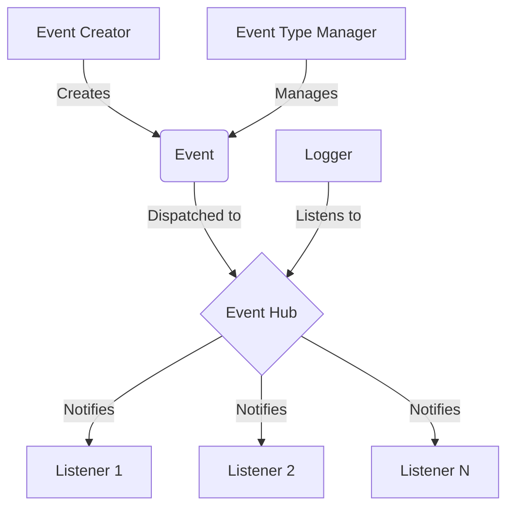
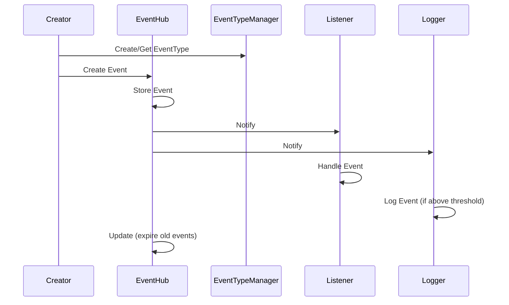

# Event System Documentation

## Overview

The Event System is a flexible, decoupled communication mechanism that allows different parts of an application to interact without direct dependencies. It consists of several key components:

1. Events
2. Event Hub
3. Listeners
4. Event Type Manager
5. Logger

## System Architecture



## Components

### 1. Events

Events are the core of the system. They represent occurrences or state changes in the application.

- Base class: `Event`
- Specific event types (e.g., `LogEvent`) inherit from `Event`
- Each event has a type and an expiration time

### 2. Event Hub

The Event Hub is the central dispatcher for all events.

- Singleton class `EventHub`
- Maintains a list of listeners for each event type
- Dispatches events to registered listeners
- Manages event lifecycle (creation, dispatch, expiration)

### 3. Listeners

Listeners are objects that respond to specific types of events.

- Base class: `IListener`
- Can register/unregister for specific event types
- Implement `HandleEvent` method to process received events

### 4. Event Type Manager

Manages the dynamic creation and retrieval of event types.

- Singleton class `EventTypeManager`
- Allows for runtime creation of new event types
- Ensures unique identification of event types

### 5. Logger

A specialized listener for logging events.

- Inherits from `IListener`
- Filters log events based on minimum log level
- Can be extended for different logging backends (console, file, etc.)

## Event Flow



## Usage Example

Here's a basic example of how to use the Event System:

```cpp
// Create a custom listener
class MyListener : public IListener {
public:
    MyListener() : IListener({EventType::LOG_INFO, EventType::LOG_WARNING}) {}

    void HandleEvent(const Event* event) override {
        const LogEvent* logEvent = dynamic_cast<const LogEvent*>(event);
        if (logEvent) {
            std::cout << "Received log message: " << logEvent->message << std::endl;
        }
    }
};

int main() {
    EventHub& eventHub = EventHub::getInstance();
    EventTypeManager& eventTypeManager = EventTypeManager::getInstance();

    MyListener listener;

    // Create and dispatch an event
    eventHub.createEvent<LogEvent>(EventType::LOG_INFO, 1, "Hello, EventSystem!");

    // Process events
    eventHub.update();

    return 0;
}
```

## Best Practices

1. Keep events lightweight and focused on data, not behavior.
2. Use the Event Type Manager to create custom event types as needed.
3. Design listeners to handle specific event types efficiently.
4. Regularly call `EventHub::update()` to process and expire events.
5. Use the Logger for system-wide logging with appropriate log levels.
